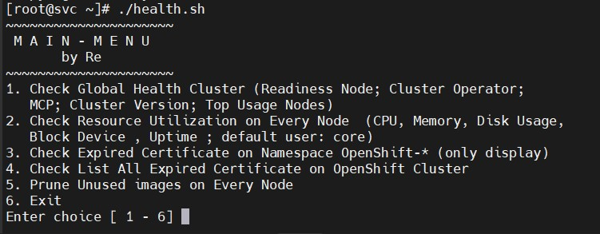

# Simple Bash App for OpenShift Container Platform 
A tool for help Preventive Maintenance and gather information your OCP (OpenShift Container Platform) / OKD Cluster by _Reinhart Utama_

## Features

- Check Global Health Cluster (Readiness Node; Cluster Operator;\n   MCP; Cluster Version; Top Usage Nodes) and Create log information 
- Check Resource Utilization on Every Node  (CPU, Memory, Disk Usage,\n   Block Device , Uptime ; default user: core)
- Check Expired Certificate on Namespace OpenShift-* (only display)
- Check List All Expired Certificate on OpenShift Cluster and create log information
- Prune Unused /old/ build cache images on Every Node 

## License

GPL v3.0

**A Simple Code can make Simple Life ^_^**